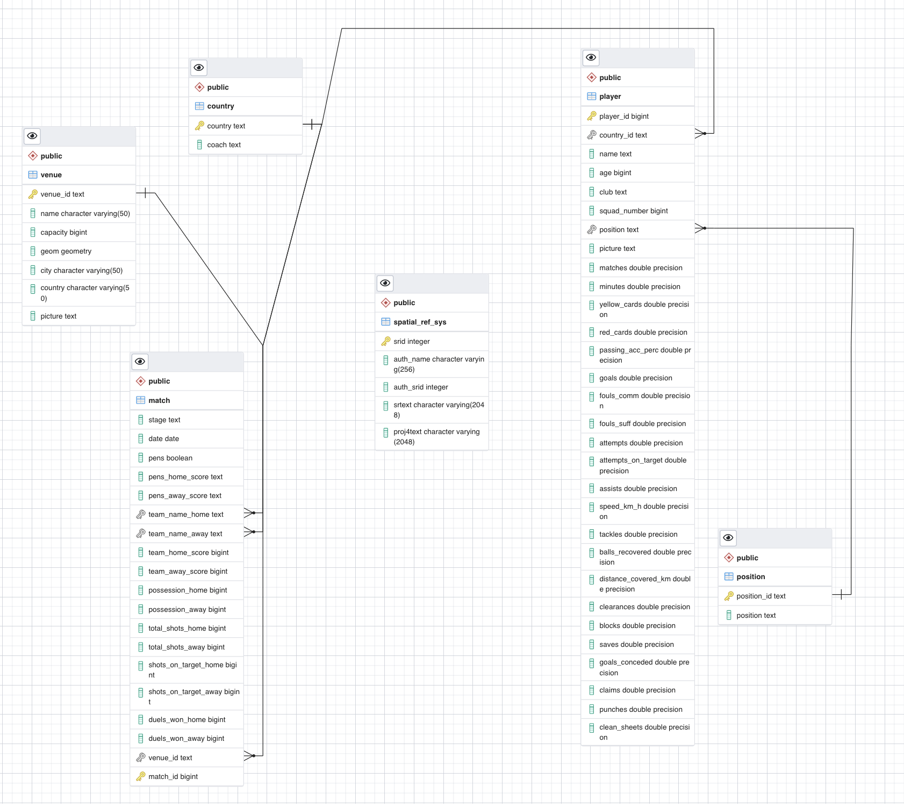

# UEFA Euro Cup 2020 Big Data project

This is a little project done for the Big Data and Machine Learning bootcamp of [Core Code School](https://www.corecode.school/)

## Abstract

Here is all the necessary code to create a Euro Cup 2020 database in Postgresql, an api in Flask and a frontend with Streamlit. The resulting webapp displays:
- A map with the locations of all the venues that hosted the final phase matches
- A tool to know what players had each club participating on this tournament
- Some little correlation between statistics fetched from the different games
- At last, but not least, a tool to filter the different players, using some of their statistics (such as number of matches played, or their passing accuracy percentage), to help coaches finding potential players for their clubs

## Quickstart

1. Clone the repository: `git clone https://github.com/leti-olabarri/euro-2020.git`
2. Define all the necessary environmental variables (see below)
3. Install the libraries defined in the `front` and `src` folders (it is better to install them in different environments, just in case streamlit gives problems)
4. In separate terminal windows and from the root of the project, run `python src/server.py` (to run the api) and `streamlit run front/dashboard.py`
4. ENJOY!

## Data used

- Dataset from Kaggle: [UEFA Euro Cup 2020](https://www.kaggle.com/mcarujo/euro-cup-2020), by [Marco Carujo](https://www.kaggle.com/mcarujo), for all the matches
- Data scrapped from [UEFA Euro Cup 2020](https://www.uefa.com/uefaeuro-2020/) official website, for data about players, coachs and venues

## Technologies used

### Language

- Pure Python and a little bit of HTML (but very very little)

### Database

- **Postgresql**
- **Jupyter-Notebook** (for cleaning the dataset, webscrapping and creating the database, with all its tables and data)
- **Postgis** (for the geographical data)

You can check the libraries in the [requirements.txt](data/requirements.txt)

### API

- **Flask** (for making a working backend)

You can check the libraries in the [requirements.txt](src/requirements.txt)

### Frontend

- **Streamlit** (for the (beatiful) visual part of the webapp)
- **Folium** (to display the maps)

Again, you can check the libraries in the [requirements.txt](front/requirements.txt)

## Required environmental variables

### Database

- `POSTGRES`: just email me if you really want this credential

### API

- `PORT`: port where the api is going to listen in your localhost.
- `POSTGRES`: just email me if you really want this credential

### FRONT

- `API_URI`: just `http://localhost:{PORT}`, using the PORT you already defined previously

## API ENDPOINTS

### CLUBS
- [GET] "/clubs": name of all the clubs that had players on the tournament
- [GET] "/clubs/count-players": club name and the number of players it had in the Euro Cup 2020
- [GET] "/clubs/{clubName}": name, picture, position and goals of that specific club's players

### MATCHES
- [GET] "/matches": all the statitistical data of all the matches in the final phase
- [GET] "/matches/{stage}": stage, name of the home team, score of the home team, name of the away team, score of the away team, for that specific stage of the competition

### PLAYERS
- [GET] "/player/{playerName}": all the data of the given player (name, squad number, position, country, minutes played, etc.)
- [GET] "/player/stats?": players who have the characteristics given by the parameters (you have to give at least one parameter):
    - position
    - age_min
    - age_max
    - matches_min
    - matches_max
    - passing_acc_perc
    - passing_acc_perc_max
    - goals_min
    - goals_max
    - fouls_comm_min
    - fouls_comm_max
    - fouls_suff_min
    - fouls_suff_max
    - attempts_min
    - attempts_max
    - attempts_on_target_min
    - attempts_on_target_max
    - assists_min
    - assists_max
    - speed_km_h_min
    - speed_km_h_max
    - balls_recovered_min
    - balls_recovered_max
    - distance_covered_km_min
    - distance_covered_km_max
    - clearances_min
    - clearances_max
    - blocks_min
    - blocks_max
    - saves_min
    - saves_max
    - goals_conceded_min
    - goals_conceded_max
    - clean_sheets_min
    - clean_sheets_max

### VENUES
- [GET] "/venues": name, capacity, geodata, city, and country of all the venues

## TABLES' RELATIONSHIPS

Here there is a picture of the tables' relationships, whether you have that information on the [schema.pgerd](data/schema.pgerd) file

